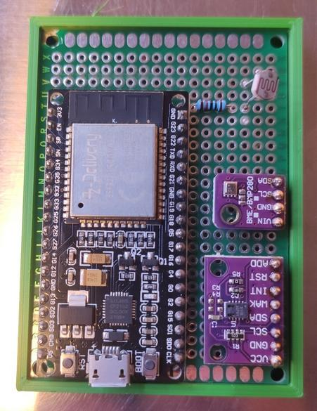

# Fermentation Supervisor

A couple of sensors that make it easier to supervise a fermentation process.
This tracks:

* Temperature
  * Helps with keeping the fav temperature of good microorganisms.
* Relative humidity.
  * Keeps mold in check.
* Air pressure
  * Not needed, but came for free with the BME280.
* eCO2 concentration
  * Byproduct of most common fermentation processes.
* Volatile organic compounds
  * Not needed, but came for free with the CCS811.
* Ambient brightness.
  * Some microorganisms are sensitive to brightness.

All sensor measurements are periodically, and measurements are published to these MQTT topics:

* `fermentation-supervisor/temperature` (C)
* `fermentation-supervisor/humidity` (relative %)
* `fermentation-supervisor/pressure` (hPa)
* `fermentation-supervisor/co2` (ppm)
* `fermentation-supervisor/tvoc` (ppb)
* `fermentation-supervisor/brightness` (%)
  * Maximum is direct sunlight, minimum is roughly equivalent to indoors at night.

## Parts

* ESP32
* BME280 temperature/humidity/pressure sensor
* CCS811 eCO2/TVOC sensor
* Light-sensitive resistor
* 10k Ohm resistor

## Setup

### Hardware

* Connect BME280 and CCS811 to default I2C pins (21 for SDA, 22 for SCL).
* Hook up the sensors' power to 3.3V and GND.
* Connect CCS811's WAKE pin to ground to enable it.
* Connect the light-sensitive resistor like so:
  * One end is hooked up to 3.3V
  * The other is connected to pin 32.
  * Also connect the other end to GND with a 10k Ohm resistor.

### Software

Prior to compiling and uploading the code, make sure to copy `includes/config.example.h` to
`config.h`, and fill in WiFi credentials, plus the IP address of the MQTT server.

## Future ideas

* Add temperature probes for monitoring fermenting liquid directly.
* Hook up heating/cooling for active control of ambient temperature.
* Add sensors for other fermentation byproducts to gain more progress insights.
* Improve power efficiency by powering sensors selectively, using deep sleep...